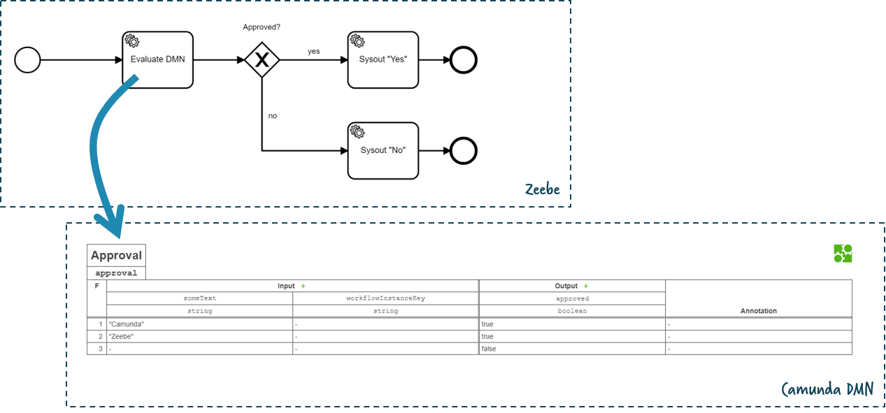
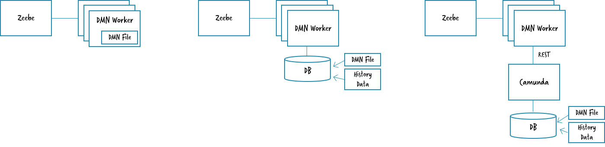

# DEPRECATED: This repo is deprecated, as DMN has landed as out-of-the-box feature in Camunda 8

# How-to use Camunda DMN decision tables in Zeebe



# Screencast

This video walks you through this example:

<a href="http://www.youtube.com/watch?feature=player_embedded&v=Q3tLKV-6J3c" target="_blank"></a>


# Basic architecture: connect Camunda DMN via Zeebe job workers

From Zeebes perspective Camunda DMN is something external which is connected via a Zeebe [Job Worker](https://docs.zeebe.io/basics/job-workers.html). 

The BPMN workflow for Zeebe adds a couple of custom headers to configure DMN evaluation:

```xml
<bpmn:serviceTask id="decisionTask" name="Evaluate DMN">
  <bpmn:extensionElements>
    <zeebe:taskDefinition type="DMN" />
    <zeebe:taskHeaders>
      <zeebe:header key="decisionRef" value="approval" />
      <zeebe:header key="decisionResultMapping" value="singleEntry" />
      <zeebe:header key="decisionResultVariable" value="approved" />
    </zeebe:taskHeaders>
  </bpmn:extensionElements>
</bpmn:serviceTask>
```

## Architecture Options



Now there are three basic architecture alternatives:

1. **[Stateless DMN engine](zeebe-camunda-dmn-embedded-stateless)**: Camunda supports to run DMN evaluations in a stateless manner. Therefor you simply leverage the DMN engine as Java jar file. This is showcased in [zeebe-camunda-dmn-embedded-stateless](zeebe-camunda-dmn-embedded-stateless). Use if you don't need versioning of your DMN models or history. This is by far the most simple and most performant approach.

2. **[Decision Service in embedded Camunda BPM Platform](zeebe-camunda-dmn-embedded-platform)**: Run a full Camunda BPM platform embeded in the Java application also running the Zeebe Worker (e.g. in Spring Boot). This allows to version DMN models and keep a history of decision evaluations. It is showcases in [zeebe-camunda-dmn-embedded-platform](zeebe-camunda-dmn-embedded-platform). Use if you want to have versioning and history and you develop in Java and Spring Boot.

3. **Decision Service via REST API**: This allows for the same features, but separates the Zeebe Worker from the Camunda platform. This allows to [run Camunda as a service](https://github.com/berndruecker/camunda-on-pcf/tree/master/engine-as-a-service) independant of the usage from Zeebe. Use if you want to have versioning and history, but don't want to dive much into Java and Spring Boot. This worker is pretty generic and reusable. **TODO**

## How to use

* Select the showcase of your choice to run the Job Worker:
  * [zeebe-camunda-dmn-embedded-stateless](zeebe-camunda-dmn-embedded-stateless)
  * [zeebe-camunda-dmn-embedded-platform](zeebe-camunda-dmn-embedded-platform)
  * zeebe-camunda-dmn-rest is todo
* Afterwards run the Zeebe sample workflow:
  * [zeebe-camunda-dmn-sample-java](zeebe-camunda-dmn-sample-java)
