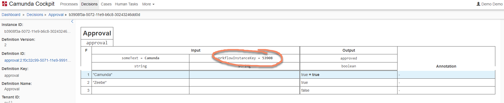

# Zeebe Job Worker + Camunda BPM Platform as Spring Boot App

This sample application combines a Zeebe [Job Worker](https://docs.zeebe.io/basics/job-workers.html) with a Camunda BPM Platform to evaluate DMN decisions as part of BPMN workflows. See [repository root](../../../) for a general introduction.

The Spring Boot application starts up a full Camunda platform including persistence. It will scan the classpath for DMN files to be deployed. DMN models are versioned. 

In the `application.properties` you can configure various things, especially the Zeebe endpoint:

```
zeebe.brokerContactPoint=localhost:26500
```

## How to run

Build with Maven

`mvn clean install`

Execute the JAR file via

`java -jar target/zeebe-camunda-dmn-embedded-platform.jar`

Now you can [run a workflow in Zeebe](../../../zeebe-camunda-dmn-sample-java) and see the DMN being evaluated.

## Decision History

Every decision evaluation will be written to the [Camunda History](https://docs.camunda.org/manual/latest/user-guide/process-engine/history/) unless you configure Camunda otherwise.

Now you probably want to connect these historic decision instances with the right Zeebe workflow instances. There are two basic approaches to achieve this:

1. Capture the HistoricDecisionInstance.Id from Camunda and write it to a Zeebe workflow variable
2. Add a column to store the workflow key in the decision instance

### Capture the HistoricDecisionInstance.Id from Camunda and write it to a Zeebe workflow variable

Currently it is not supported out of the box to retrieve the Id of the so called historic decision instance in Camunda. In the embedded Spring Boot example it is however easy to hook-in a small plugin to capture that Id, so we can add it as variable to Zeebe later.

See [CaptureHistoryDmnHistoryEventProducer](src/main/java/io/berndruecker/demo/zeebe/dmn/platform/CaptureHistoryDmnHistoryEventProducer.java#L9) for details on how this is implemented.

When you [run the sample workflow in Zeebe](../../../zeebe-camunda-dmn-sample-java) you will see a sysout that there is a workflow variable like `historyDmnDecisionInstanceId_66355` (the 66355 is the job key to make it unique):

```
Started workflow instance CreateWorkflowInstanceResponseImpl{workflowKey=66345, bpmnProcessId='dmn-example', version=19, workflowInstanceKey=66349}

Variables after DMN evaluation: {approved=true, someText=Camunda, historyDmnDecisionInstanceId_66355=4a7f4660-5088-11e9-afbd-30243246dd0d}
```

Note that this trick will not work if you leverage the Camunda Platform via REST API.

### Add a column to store the workflow key in the decision instance

The very easy approach is to add a column to your decision table. In this showcase we add `workflowInstanceKey` as well as `workflowJobKey` as variables you could add without using them in the decision logic. This will capture the data in the history:



The downside is of course that this is visible in your DMN decision table. But it does work out of the box.